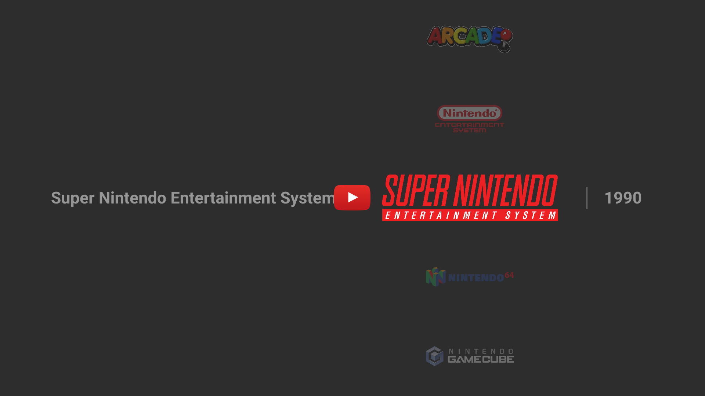

# COLORFUL

---
A port of the COLORFUL bigbox theme to Pegasus.

---

Video assets for the Collections pages **are required** to be downloaded separately. 
1080P versions for many platforms (60+), renamed for this theme [are available here](https://mega.nz/folder/6VByEKTS#I7yela1-PrAzneLCQkw1jg).
Additional platforms can be found at the [creators page](https://forums.launchbox-app.com/files/file/1958-colorful-platform-video-set/).

Collections must be named using the shortnames listed below to work properly or can be edited in the collectiondata.qml

Platform shortnames:
3do, 3ds, amiga, android, arcade, atari2600, atari5200, atari7800, atarijaguar, atarilynx, atomiswave, c64, cdi, colecovision, cps1, cps2, cps3, dos, dreamcast, famicom, fbneo, fds, gamecube, gamegear, gb, gba, gbc, genesis, gw, intellivision, mame, mastersystem, msx, mvs, n64, naomi, nds, neogeo, neogeocd, nes, ngp, ngpc, odyssey2, pcecd, pcengine, pico8, pokemini, ps2, psp, psx, saturn, scummvm, sega32x, segacd, sfc, sg1000, snes, supergrafx, switch, tg16, tgcd, vboy, vectrex, vita, wii, wswan, wswanc, x68000, zxspectrum

---

## Metadata used in the theme:
- `boxFront`
- `screenshot`
- `wheel`
- `video`
  
---

## Issues:
I'm pretty new to this, feel free to reach out if anything is not working as expected!

---

## Credits:
- viking - creator of the [COLORFUL media set and theme](https://forums.launchbox-app.com/files/file/2081-colorful-bigbox-theme/)
- Dan Patrick - [v2 Platform Logos](https://forums.launchbox-app.com/files/file/3402-v2-platform-logos-professionally-redrawn-official-versions-new-bigbox-defaults/page/2/?tab=comments#comment-12469)
- All the Pegasus theme creators that I have borrowed ideas from especially [epic-memories-theme](https://github.com/FrenchGithubUser/epic-memories-theme), [retromega-sleipnir](https://github.com/TigraTT-Driver/shinretro) and [shinretro
](https://github.com/y-muller/retromega-sleipnir)

---

## To Do
- [ ] Fall back images for no collection video
- [ ] Mark as favorite button
- [ ] Add favorite icons to game views
- [ ] Touch controls
- [ ] All/Favorites/Recents collections
- [ ] Battery/clock
- [ ] Shortcut keys to change collection index from game view
- [ ] Shortcut keys to move to start/end of list / skip letter
- [ ] Nav sounds
- [ ] Better color matching between videos and rendered text/shapes
- [ ] Favorites filter
- [ ] Favorites on top toggle
- [ ] Fix game auto scroll on first transition to list view
